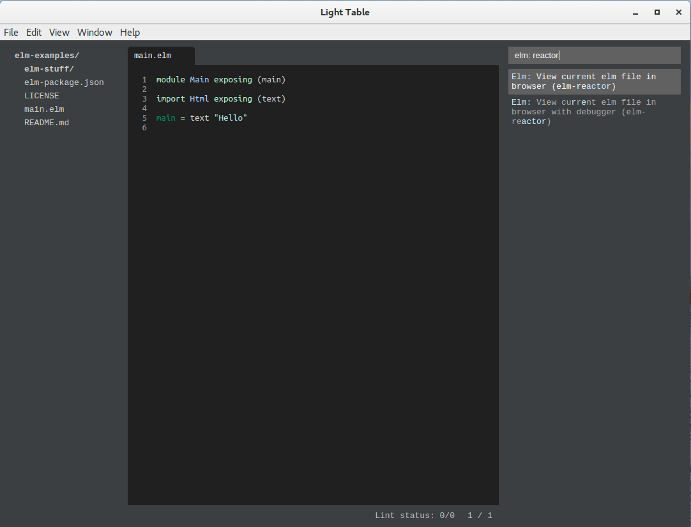
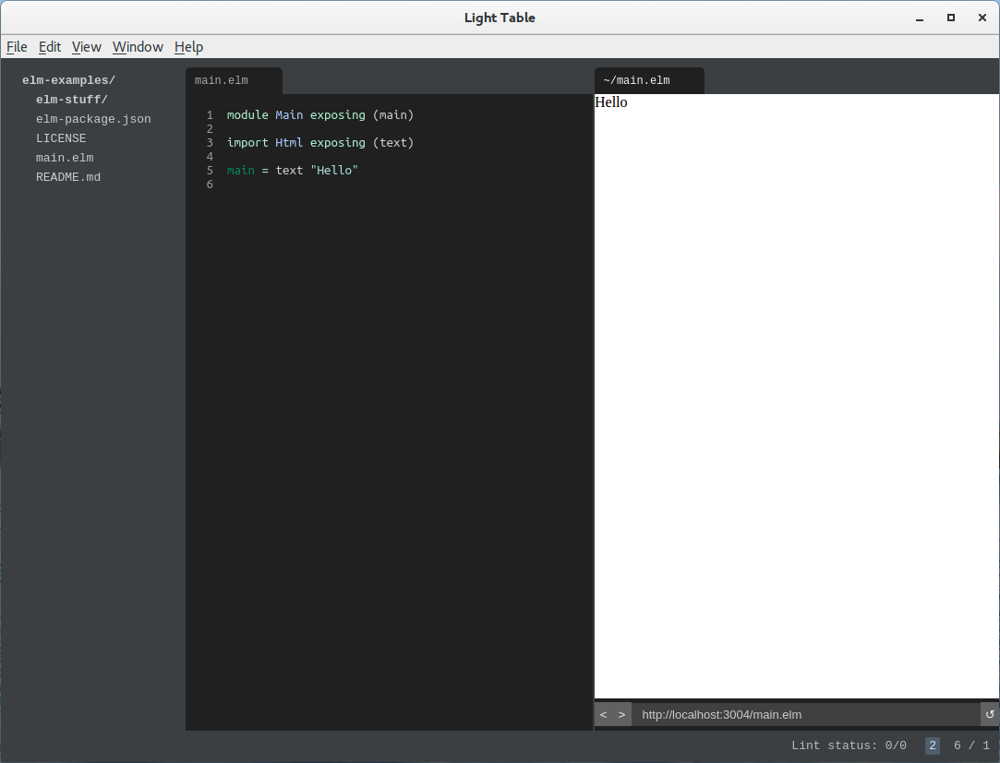
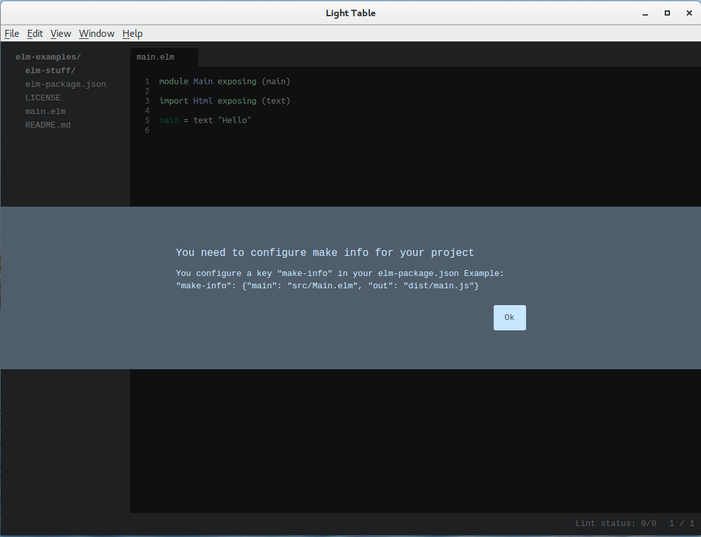
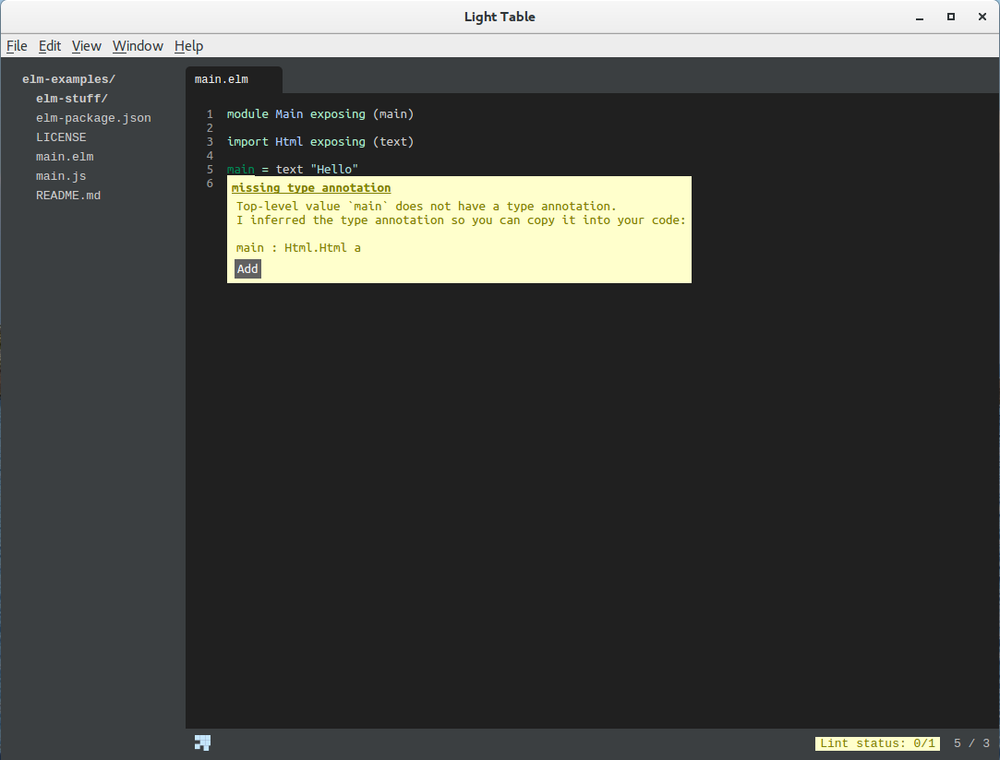
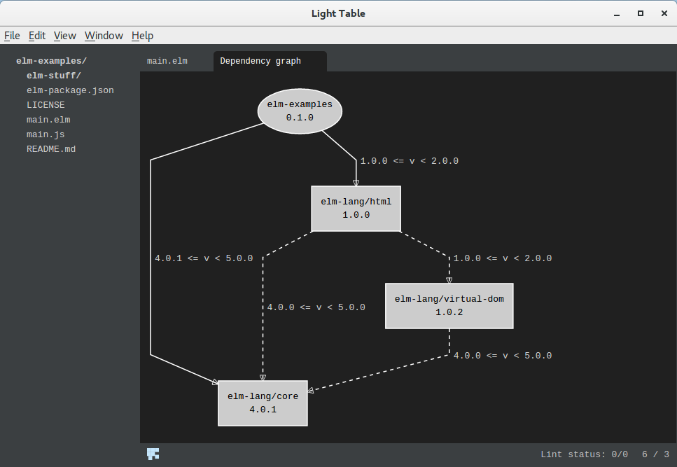
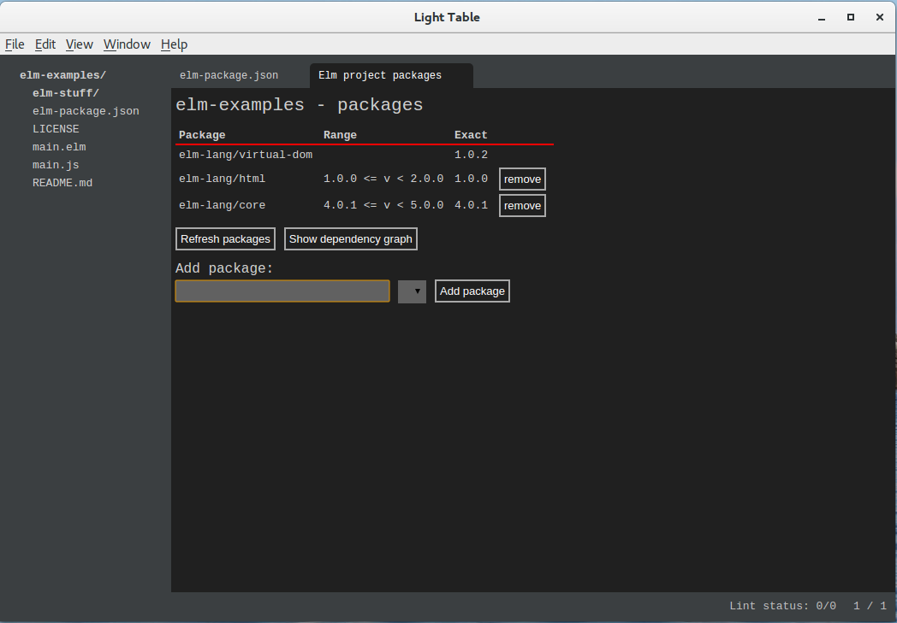
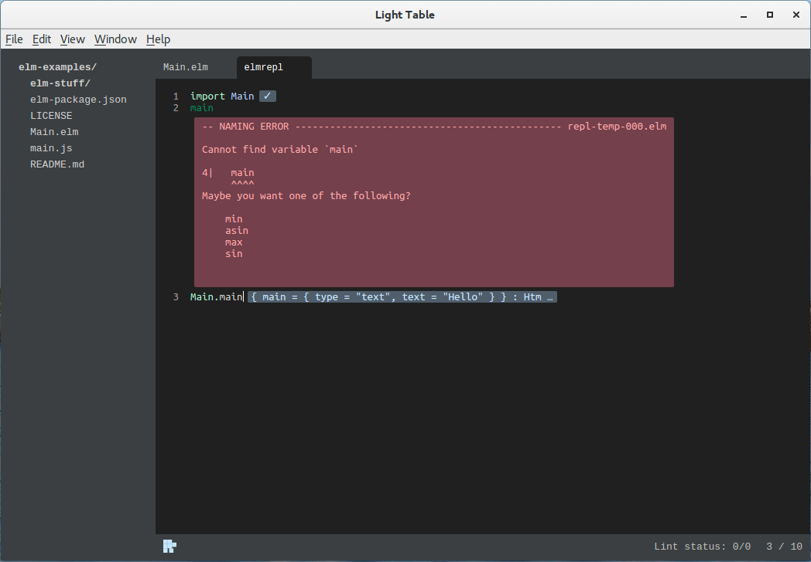

# Инструменты разработчика на языке Elm

_Эта статья в немного другой редакции была первоначально опубликована на
Habrahabr: [https://habrahabr.ru/post/302154/](https://habrahabr.ru/post/302154/)_

_Elm_ это функциональный язык программирования для разработки веб-приложений,
работающих в браузере. Elm строгий, статически типизированный. Elm похож на
Haskell, однако это лишь поверхностное сходство, ведь Elm изначально заточен
для быстрой разработки веб-приложений. Эта статья представляет из себя
шпаргалку для начинающих по основам разработки на языке Elm, а именно, здесь
рассматривается организация проекта, инструментарий Elm и среда разработки
Light Table. Часть шагов, если не актуально или не применимо, можно пропустить.

## Установка Elm

Elm можно установить как пакет NPM:

``` bash
npm install -g elm
```

## Установка Light Table

Elm поддерживается в виде плагинов многими продвинутыми редакторами: Emacs,
Visual Studio Code, Brackets и другими. Но, пожалуй, самая продвинутая IDE для
Elm доступна в **Light Table** [http://lighttable.com/](http://lighttable.com/)
в виде соответствующего плагина. Домашняя страничка этого плагина:
[https://github.com/rundis/elm-light](https://github.com/rundis/elm-light).
Там же можно прочитать о его возможностях по разработке на Elm.

Для большего удобства можно также установить плагин терминала
[Terminal](https://github.com/alun/terminal). Для
его работы также потребуется установить
[butterfly](https://github.com/paradoxxxzero/butterfly):

``` bash
sudo apt install libssl-dev
pip3 install butterfly
```

После установки butterfly нужно добавить в `.profile` к переменной `PATH` путь
`~/.local/bin` и повторно зайти в систему.

## Проект на GitHub

Регистрируем проект на GitHub (кроме имени, задаём репозиторию краткое, в одну
строчку описание проекта на английском языке; для .gitignore задаём тип
проекта Elm; выбираем лицензию (для Elm характерна лицензия BSD с тремя
пуктами); выбираем опцию создания файла README).

Клонируем репозиторий на компьютер:

``` bash
git clone path_to_repository
```

## Установка пакета Html

Для разработки веб-приложения на Elm потребуется пакет Elm html. Для этого
переходим в каталог проекта (он может быть абсолютно пустым) и запускаем в нём
следующую команду:

``` bash
elm package install elm-lang/html
```

Во время установки `elm-package` предложит добавить информацию об этом пакете
в файл `elm-package.json`. Соглашаемся с этим (тем более, что плагин
Light Table для Elm определяет проект Elm по наличию этого файла). Затем он
сообщит нам, что нужно установить зависимости этого пакета. Тоже соглашаемся.
В результате получаем установленными три пакета: `elm-lang/core`,
`elm-lang/html` и `elm-lang/virtual-dom`. Пакеты устанавливаются в подкаталог
`elm-stuff`, который не обязательно сохранять в репозитории, что и прописано в
`.gitignore`. А вот почему там же прописан по-умолчанию elm-package.json,
непонятно. Поэтому откроем .gitignore в любом редакторе и удалим
соответствующую строку.

## Открываем проект в Light Table

Теперь можно открыть проект в Light Table. Для этого запускаем сам редактор
(в Linux команда `light`, если каталог Light Table прописан в PATH) и идём в
`File/Open folder`, выбираем соответствующий каталог проекта.

## Правим elm-package.json

Файл elm-package.json в проекте на языке Elm играет такую же роль, как и
package.json в проектах на базе JavaScript.

После установки первого пакета мы получим elm-package.json примерно такого
содержания:

``` json
{
    "version": "1.0.0",
    "summary": "helpful summary of your project, less than 80 characters",
    "repository": "https://github.com/user/project.git",
    "license": "BSD3",
    "source-directories": [
        "."
    ],
    "exposed-modules": [],
    "dependencies": {
        "elm-lang/core": "4.0.1 <= v < 5.0.0",
        "elm-lang/html": "1.0.0 <= v < 2.0.0"
    },
    "elm-version": "0.17.0 <= v < 0.18.0"
}
```

Очевидно, что нужно отредактировать содержимое полей `version`, `summary` и
`repository`.

## Создание главного модуля

В корне проекта разместим главный модуль приложения. Например, такого содержания:

``` elm
module Main exposing (main)

import Html exposing (text)

main = text "Hello"
```

## Запуск приложения

Для запуска приложения нужно открыть окно команд редактора (`Ctrl-Space`) и
набрать `elm: reactor`. В появившемся списке выберем `Elm: View current elm
file in browser (elm-reactor)`.



После чего должно открыться окно встроенного
браузера с запущенным нашим приложением. Если видим пустое окно браузера, то
немного подождав, обновим его содержимое (`Ctrl-R`). Должны увидеть надпись
`Hello`.



Чтобы видеть окно браузера открытым рядом с окном редактора кода, нужно
вызвать контекстное меню окна браузера и выбрать пункт меню
`Move tab to new tabset`.

## Автообновление приложения

`elm-reactor` предназначен для облегчения разработки приложений на Elm.
Во-первых, он предоставляет статический веб-сервер для разрабатываемого
приложения. Во-вторых, он следит за изменениями проекта, пересобирает его
при появлении изменений и обновляет содержимое окна браузера. ~~Правда у автора
последняя функция почему-то не работала. Возможно из-за того, что плагин для
Elm ещё не был адаптирован для версии 0.17.0.~~ Эта функция в текущей версии
отключена, но можно воспользоваться сторонним инструментом: [elm-live](https://github.com/tomekwi/elm-live):

``` bash
elm-live Main.elm
```

`elm-live` устанавливается как пакет NPM:

``` bash
npm install -g elm-live
```

## Сборка проекта

Для сборки (компиляции) проекта или отдельного модуля нужно открыть окно команд
(`Ctrl-Space`), набрать `elm: make` и выбрать соответствующий пункт меню.

При первой попытке собрать весь проект возникнет такая проблема:



Откроем elm-package.json и отредактируем его соответствующим образом:

``` json
"make-info": {
  "main": "main.elm",
  "out": "main.js"
}
```

В командной строке нужно в каталоге проекта запустить команду:

``` bash
elm make
```

## Проверка модуля

Для проверки модуля нужно открыть соответствующий файл модуля, открыть окно
команд, набрать `elm: lint` и выбрать `Lint selected file`. После проверки
проблемные места в коде будут подчёркнуты. Чтобы посмотреть, что за проблемы,
нужно сначала поставить курсор на подчёркнутое место в коде, затем вновь
обратиться к окну команд и набрать `linter: show`. Возле проблемного места
появится всплывающее окно с комментарием.



Если нажать клавишу Enter или щёлкнуть на соответствующую кнопку в окне, можно
получить исправление проблемы.

Набрав в окне команд `linter:` можно увидеть и другие функции этого инструмента.

## Граф зависимостей

Для построения графа зависимостей нужно в окне команд набрать `elm: graph` и
выбрать пункт `Elm: Show dependency graph`.



## Управление пакетами

Для управления пакетами, как было уже сказано в самом начале, есть команда
`elm package`, но плагин для Light Table также предоставляет визуальное
средство управления пакетами проекта. Для этого как обычно открываем окно
команд, набираем в нём `elm: package` и выбираем пункт
`Elm: Show project packages`.



## REPL

REPL можно вызвать как из командной строки, запустив команду

``` bash
elm repl
```

Так и в среде Light Table. Для этого открываем окно команд, набираем в нём
`elm: repl` и выбираем пункт `Elm repl: Open a elm repl`.

Для запуска кода модуля в REPL нужно сначала модуль импортировать:

``` elm
import Main
```

После чего можно вызвать какую-нибудь функцию:

``` elm
Main.main
```

В REPL после ввода кода нужно нажимать `Ctrl-Enter`.



## Что дальше

* начало: [http://elm-lang.org/get-started](http://elm-lang.org/get-started)
* руководство: [http://guide.elm-lang.org/index.html](http://guide.elm-lang.org/index.html)
* примеры: [http://elm-lang.org/examples/](http://elm-lang.org/examples/)
* пакеты: [http://package.elm-lang.org/](http://package.elm-lang.org/)
* интерактивная разработка: [http://elm-lang.org/blog/interactive-programming](http://elm-lang.org/blog/interactive-programming)
* отладка: [http://debug.elm-lang.org/](http://debug.elm-lang.org/)

## Результаты голосования на Habrahabr

К этой статье на Хабрахабр было прикреплено голосование, где автор
интересовался у читателей их отношением к Elm, если они программируют на
функциональных языках. На момент публикации статьи здесь (то есть по истечении
более недели) результаты голосования следующие:

* 15% -- годный, я на нём уже программирую
* 18% -- годный, но писать на нём не собираюсь
* 18% -- первый раз слышу, но выглядит годным
* 18% -- сыроват для продакшн
* 31% -- не нужен

Предложенные варианты не полны. Но отредактировать голосование, к сожалению,
не удалось из-за багов редактора голосования.

Всего проголосовало на тот момент 99, воздержалось 76. При том, что прочитало
статью 5,5 тыс., а 41 добавил в избранное. Статья публиковалась в двух хабах:
функциональное программирование и веб-разработка. Думаю относительное большое
количество читателей связано со вторым хабом, а вот малое число проголосовавших
уже с первым. За вариант "годный, я на нём уже программирую" проголосовало 14
читателей. Если спроецировать это число на общее количество читателей, то
получим 0,25%. Мнение о годности языка высказал 51% проголосовавших. Ну и 31%
высказался за то, что язык не нужен. Наконец, автор выбрал пункт "сыроват для
продакшн". Причина этого в том, что язык ещё не устоялся. Это видно по переходу
с версии 0.16 к 0.17, когда были внесены несовместимые изменения и в синтаксис,
и в основные пакеты. В версии 0.17 были отключены отладочные средства до лучших
времён. Но как только язык и его средства разработки стабилизируются, автор
проголосует за то, что "годный, я на нём уже программирую".

## Послесловие

Присоединяйтесь к русскоязычному сообществу во Вконтакте:
[https://vk.com/elm_lang_ru](https://vk.com/elm_lang_ru). На момент публикации
статьи в сообществе состояло 42 участника, 40 из которых присоединилось
благодаря этой статье на Хабрахабр.

## История обновлений

_2016-06-14_ Добавил информацию об установке терминала в Light Table.

_2016-06-10_ Добавил информацию об elm-live.
